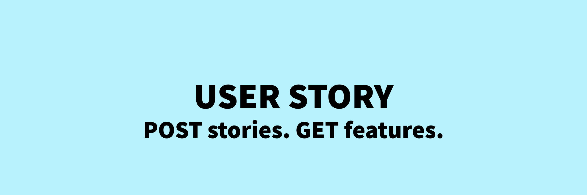
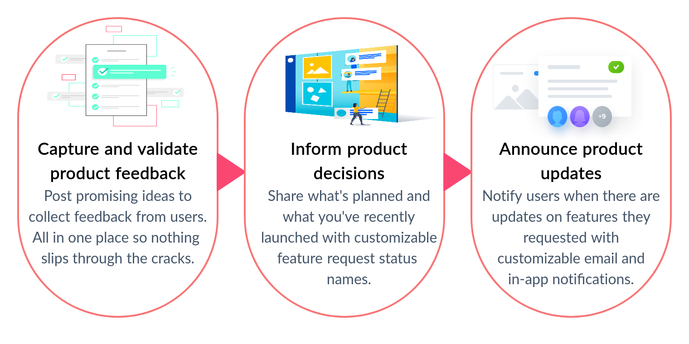

# User Story

# Introduction

The goal of **User Story** is to design and present a scalable backend infrastructure that delivers a web interface allowing users to request new features and give feedback in an easy and intuitive way. Users can attach files with their story to explain what they want. The admins can then resolve, close and update the status of these stories. Users can interact with other stories via comments and votes. This can also serve as an efficient feedback and response mechanism which is critical for any organization to improve and make progress. Simply, its a **product management tool**.

# How it works

# Guidelines for development
### Setting up the project

After cloning this repository you will need to install all the dependencies: `npm i`

User Story uses [this repository](https://github.com/EOS-uiux-Solutions/strapi) as its `backend`. There are two ways to set up the `backend`:

- You can use Docker to setup backend by following [these instructions](https://github.com/EOS-uiux-Solutions/strapi#using-docker) If you are planning to work only on the `frontend` of User Story, then follow along.

- You can setup `backend` locally by following [these instructions](https://github.com/EOS-uiux-Solutions/strapi#locally).

If you want to work only on the `frontend` then go to `src/config.json` and change the value of `apiURL` to `https://userstory-strapi.herokuapp.com`.

Then run: `npm start` to run the app in development mode.

Open [http://localhost:3000](http://localhost:3000) to view it in the browser.

The page will reload if you make edits. You will also see any lint errors in the console.

### JS and SCSS quality assurance

Before submitting a PR/MR make sure your code is compliant with our JS rules by running: `npm run test:js`
You can format it automatically by running: `npm run format`.

To make sure your SCSS is compliant run: `npm run test:scss`

### Build it to ensure it will work on production

`npm run build`

Builds the app for production to the `build` folder. It correctly bundles React in production mode and optimizes the build for the best performance.

The build is minified and the filenames include the hashes. 

Your app is ready to be deployed!

See the section about [deployment](https://facebook.github.io/create-react-app/docs/deployment) for more information.

# How to contribute

### Code contributions

1. Open a new issue or pick an open issue from the issue list and claim it in the comments. Make sure that the issue is confirmed so you don't work on something that will not be approved to be merged.
2. Make sure you follow our best practices: [refer to our Wiki](https://gitlab.com/SUSE-UIUX/eos/-/wikis/home). You'll find information on writing code, how to name a branch, how we release, etc.
3. Join Slack [optional] to get in touch with the maintainers if you have any doubt: [join slack](http://slack.eosdesignsystem.com/)
4. Make sure you fork the project, cloning it will not give you the right access to open a PR/MR. [How to open a PR in open source](https://gitlab.com/SUSE-UIUX/eos/-/wikis/Basic-git-instructions-for-beginners)

### Design contributions

If you'd like to contribute with design changes, you'll have to do as follows:

1. [Open an issue](https://github.com/EOS-uiux-Solutions/user-story/issues/new)
2. Add all relevant information to the issue. Please be as descriptive as possible. Add links to references, images, videos, etc.
3. While working on your design, please make sure you follow our [design guidelines](https://gitlab.com/SUSE-UIUX/eos/wikis/Design-process-and-feedback-gathering).
4. Once the issue is approved by us, it'll be ready to be implemented.

# Learn more about the EOS Design System

- [EOS Design System](https://www.eosdesignsystem.com/)

- [EOS Icons](icons.eosdesignsystem.com/)

- [Follow us on Twitter](https://twitter.com/eosdesignsystem)

- [Join us in Slack](https://eos-community.slack.com/)
